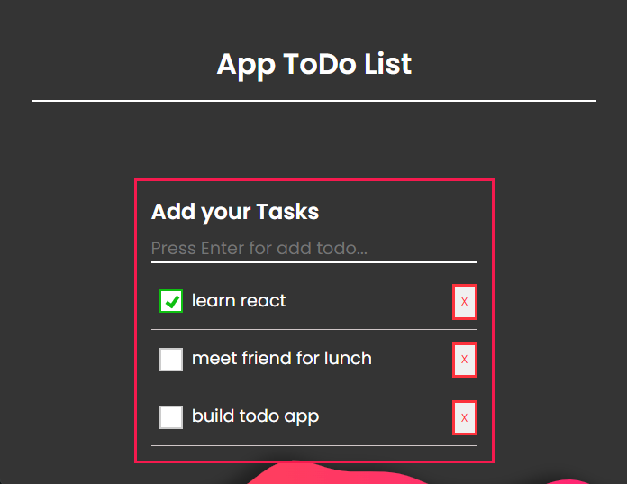

<div align="center" id="top">
     
</div>

# <h1 align="center">To Do List</h1>

<p align="center">
  <a href="#dart-description">Description</a> &#xa0; | &#xa0; 
  <a href="#dart-demo">Demo</a> &#xa0; | &#xa0;
  <a href="#memo-improvements">Improvements</a> &#xa0; | &#xa0;
  <a href="#art-technologies">Technologies</a> &#xa0; | &#xa0;
  <a href="#white_check_mark-requirements">Requirements</a> &#xa0; | &#xa0;
  <a href="#toolbox-installation">Installation</a> &#xa0; | &#xa0;
  <a href="#joystickhow-to-play">How to Play</a> &#xa0; | &#xa0;
  <a href="#briefcase-license">License</a> &#xa0; | &#xa0;
  <a href="https://github.com/arturomsoberanes" target="_blank">Author</a>
</p>

<br>


## :dart: Description ##

A Todo List with React is a sleek and efficient task management web application, powered by the popular React JavaScript library. It enables users to easily add, edit, and organize their tasks, offering real-time updates without the need for page reloads. With features like sorting, categorization, and user authentication, it provides a seamless and secure way to stay organized, and its responsive design ensures it's accessible on a variety of devices, making it a valuable tool for enhancing productivity and managing tasks effectively.

## :dart: DEMO ##

If you want to try it just click [here](https://arturomsoberanes.github.io/ToDoList/)

## :memo: Improvements ##

These are the list of current improvements:

- :diamonds: Improve the UI.

## :art: Technologies ##

- [HTML](https://www.w3schools.com/html/)
- [CSS](https://www.w3schools.com/css/)
- [JavaScript](https://www.w3schools.com/js/)
- [React](https://reactjs.org/)

## :white_check_mark: Requirements ##

Before starting :checkered_flag:, you need to have:
- [Git](https://git-scm.com).
- [Node.js](https://nodejs.org/en/).
- [Create React App](https://create-react-app.dev/).

## :toolbox: Installation ##

Clone Repository

```bash
$ git clone https://github.com/arturomsoberanes/ToDoList.git
```

Install the dependencies
```bash
$ npm install
```

## :joystick:	How to Run ##


Execute "start"

```bash
$ npm start
```


## :briefcase:	 License ##

This project is under license from MIT. For more details, see the [LICENSE](LICENSE) file.


Made with :heart: by <a href="https://github.com/arturomsoberanes" target="_blank">Arturo Soberanes</a>

&#xa0;

<a href="#top">Back to top</a>